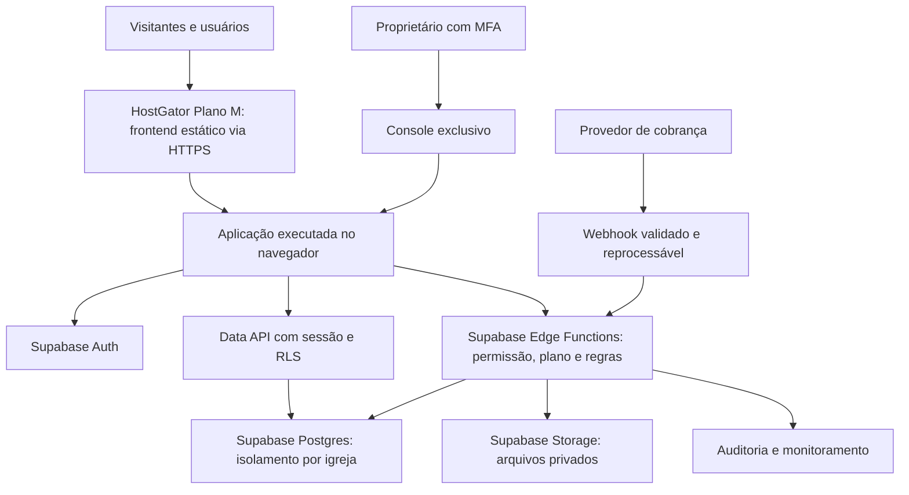

# Gestão Igreja — plano estratégico de transformação em SaaS

**Data da revisão técnica e pesquisa:** 6 de setembro de 2026. **Versão:** 1.1, atualizada com as respostas do proprietário nesta conversa. As verificações técnicas abaixo pertencem à revisão inicial e não foram repetidas nesta atualização documental.

**Diretrizes recebidas:** assinatura mensal; produto originado nas necessidades da Igreja Siloé; painel exclusivo do proprietário para vendas, planos e clientes; HostGator para hospedagem e domínio; Supabase para dados.

**Conclusão:** existe uma base de interface e de conhecimento do domínio que pode ser aproveitada. O projeto atual ainda é um protótipo de uma igreja, sem a infraestrutura operacional, comercial e de segurança necessária para vender um SaaS. A oportunidade depende de comprovar uma dor recorrente em outras igrejas, entregar uma implantação simples e manter clientes com margem positiva. Quantidade de telas, isoladamente, não comprova valor comercial.

Este documento entrega diagnóstico, posicionamento, modelo de receita, arquitetura proposta, requisitos do painel do proprietário e roadmap com critérios de aceite. O preço inicial de R$ 69,90 do Essencial Lite e seus quatro módulos são diretrizes do proprietário; sua aceitação comercial ainda precisa ser validada. Demais preços, limites, metas e cenários permanecem hipóteses de planejamento.

## Decisões incorporadas na versão 1.1

| Tema | Diretriz recebida | O que permanece aberto |
|---|---|---|
| Sequência do produto | Entregar à Siloé seu sistema completo, personalizado e único; evoluir a partir dele para SaaS | Especificação de aceite da entrega e significado contratual de exclusividade/propriedade |
| Entrada de mercado | Pequenas igrejas com uma célula, com evolução para níveis superiores | Região, denominações, limite de pessoas e operadores |
| Prioridades | Agendamento; células/membros; transparência financeira | Detalhamento dos fluxos de cada prioridade |
| Essencial Lite | A partir de R$ 69,90/mês, com Agenda, Célula, Financeiro e Avisos | Limites adicionais, recursos exatos e margem de atendimento |
| Marca | Marca comercial diferente da Siloé | Nome, domínio e verificação de disponibilidade |
| Equipe e capacidade | Codex, Claude Code, Gemini Antigravity IDE, Gemma e outros se necessários; cinco dias por semana, ao menos três horas por dia | Orçamento de ferramentas/infraestrutura e produtividade efetiva |
| Hospedagem | HostGator Plano M confirmado; proposta passa a priorizar uso da hospedagem existente | Homologação da exportação estática, configurações da conta e condições dos domínios |
| Financeiro da igreja | Confirmado: somente registrar entradas e saídas no MVP | Detalhar categorias, comprovantes, fechamento e relatórios; recebimentos online ficam para evolução |
| Dados sensíveis | Acesso somente aos administradores de cada igreja/cliente | Quais dados serão necessários; não foi confirmado cadastro de menores ou notas pastorais |
| Aquisição | Após MVP validado, divulgação e licenças de teste; leads buscados manualmente no Google; materiais gerais e por plano via NotebookLM | Duração do teste, lotes, atendimento e conversão |

Esta versão substitui a hipótese anterior de tratar a Siloé como simples piloto de um MVP reduzido, o piloto pago de R$ 149/90 dias e o cronograma baseado em 25–35 horas semanais. A contratação personalizada da Siloé e a assinatura dos futuros clientes são entregas comerciais distintas.

## 1. Escopo e evidência da revisão

Foi analisado o checkout atual em `C:\Users\reina\OneDrive\Desktop\Projetos\Gestão Igreja`, incluindo estrutura de rotas, modelos de domínio, fontes de dados, permissões de interface, operações dos módulos, componentes compartilhados, PWA, configurações, dependências e scripts de validação. A revisão relacionou os fluxos existentes às exigências de um SaaS. Não constitui auditoria exaustiva de segurança nem homologação funcional de cada interação.

O histórico do protótipo foi usado somente para orientação e confrontado com os arquivos atuais; havia referência histórica a outro caminho. As conclusões técnicas abaixo se baseiam no checkout atual.

| Verificação local | Resultado desta revisão | Limite da evidência |
|---|---|---|
| Estado inicial do Git | Sem alterações listadas | O Git apresentou aviso de leitura do arquivo global de ignore |
| Tipagem TypeScript, sem emissão | Concluída sem diagnósticos | Não demonstra comportamento correto dos fluxos |
| Análise de código, `npm.cmd run lint` | 115 apontamentos: 27 erros e 88 avisos | Inclui tipagem frouxa, regras de React e itens não utilizados; exige triagem, não correção automática indiscriminada |
| Build de produção | Falhou ao buscar Manrope no Google Fonts | Falha de conectividade na obtenção da fonte; o build completo não ficou comprovado |
| Testes de negócio | Não foi localizada suíte própria nos arquivos do projeto | Ausência de prova de isolamento, cobrança e regras persistentes |
| Navegador, mobile e instalação PWA | Não homologados nesta revisão | As observações de experiência são derivadas do código |
| HostGator e Supabase reais | Nenhum ambiente do cliente foi inspecionado ou alterado | Compatibilidade baseada em documentação pública, não em prova da conta contratada |

A aplicação não foi modificada, publicada ou conectada a serviços. Foram produzidos documentos locais de planejamento.

### 1.1 Base atual

- Next.js 16.3.3, React 19.2.8, TypeScript, Tailwind CSS 4 e componentes baseados em shadcn/Base UI.
- Separação de site público, login e portal em grupos de rotas.
- Modelos tipados de membros, finanças, células, assistência, eventos, salas e louvor.
- Componentes reutilizáveis de navegação, cartões, tabelas, diálogos e aprovações.
- Marca, metadados, contatos, ícones e manifesto associados à Siloé.
- Nenhuma dependência de Supabase no `package.json`, nem camada de integração, migrações ou modelo de assinatura localizados na aplicação.
- `next.config.ts` não configura exportação estática; `vercel.json` contém cabeçalhos específicos daquele provedor.

### 1.2 Inventário funcional e destino recomendado

As prioridades desta tabela se referem ao futuro MVP SaaS. Não excluem módulos do sistema completo contratado pela Siloé: a entrega desse cliente será especificada e validada separadamente, com suas personalizações.

| Área existente | O que o código oferece | O que falta para operação real | Prioridade proposta |
|---|---|---|---|
| Site público `/` | Conteúdo institucional, horários, ministérios, contatos e acesso ao portal | Marca por igreja, conteúdo persistente, publicação real, contato configurado e revisão de acessibilidade | Site simples no MVP; editor completo depois |
| Login `/login` | Formulário, escolha de perfil e cadastro demonstrativo | Autenticação, convite, recuperação, verificação e revogação de sessão | Fundação |
| Dashboard | Indicadores, pendências e carteira de membro | Consultas reais com permissão e atualização entre módulos | MVP |
| Administração `/admin` | Membros, perfis e aprovações ministeriais | Administração segura da própria igreja; não contempla a operação comercial do SaaS | MVP da igreja |
| Membros | Cadastro, busca, categorias, perfil e etapas de crescimento | Persistência, importação, validação, tratamento de duplicidade e permissões por campo | MVP |
| Financeiro | Entradas, despesas, fechamento de culto e telas de recibos | Regras monetárias confiáveis, comprovantes, estornos, relatórios reais e rastreabilidade | Livro-caixa básico no MVP |
| Prestação de contas | Listas e publicação demonstrativa de balanços | Derivação do livro-caixa, revisão, aprovação real e documento exportável | Relatório agregado no MVP; fluxo avançado depois |
| Salas | Calendário, solicitação e validação de horários | Conflitos e aprovações resolvidos no banco, inclusive acessos simultâneos | MVP |
| Louvor | Repertório, sugestões, aprovação e escala | Persistência compartilhada, disponibilidade e confirmação dos escalados | Entrega Siloé conforme aceite; plano SaaS superior a definir |
| Células | Grupos, relatórios e localização | Vínculo real do líder ao grupo, consultas e presença persistente | Núcleo do MVP, com uma célula no Essencial Lite |
| Notificações | Mural, caixa de entrada e formulário de disparo | Entrega real, preferências, fila, falhas e comprovantes de envio | Mural no MVP; mensagens externas depois |
| Eventos | Cadastro, inscrição, pagamento e check-in simulados | Cobrança confirmada pelo provedor, capacidade concorrente e ingresso verificável | Agenda simples no MVP; bilheteria depois |
| Social e visitas | Famílias, entregas e anotações pastorais | Separação efetiva de registros confidenciais e política específica de dados | Adiar dados pastorais sensíveis |
| Reuniões e atas | Registros e decisões locais | Versionamento, visibilidade e aceite quando necessário | Evolução |
| Enquetes | Criação e votação local | Elegibilidade e unicidade do voto; não equivale a assembleia juridicamente válida | Evolução |
| Gestão do site `/site` | Editor demonstrativo de conteúdo | Integração com o site público, rascunho, publicação e restauração de versão | Evolução |
| PWA e offline | Manifesto, ícones, instalação e cache | Política de cache para dados privados, atualização e logout seguro | Revisar antes do piloto |
| Painel do proprietário | Não localizado | Clientes, planos, cobrança, vendas, indicadores e ações auditadas | Fundação e MVP comercial |

### 1.3 Achados que impedem vender a versão atual como SaaS

**A1 — Identidade e permissão são demonstrativas.** `lib/prototype-auth.ts:10` lê o papel de `localStorage`; `app/(auth)/login/page.tsx:46` apenas grava o papel e navega para o dashboard. O layout do portal não valida sessão. A restrição de `/admin` é uma condição no cliente. Isso é compatível com um protótipo, mas não é autorização de produção. O logout em `components/layout/sidebar.tsx` somente navega para o login, sem invalidar credenciais ou limpar o papel demonstrativo.

**A2 — Não existe isolamento entre igrejas.** `lib/types.ts` não modela organização/tenant nem vínculo usuário–igreja. Os módulos importam `lib/mock-data.ts` ou possuem coleções fixas próprias. Um filtro visual por igreja não resolveria esse problema: o banco e as operações precisam impedir acessos cruzados.

**A3 — As alterações operacionais ficam em estado local.** Membros, tesouraria, escalas, reservas e outros módulos usam coleções em memória de cada página. Não há sincronização persistente entre módulos, dispositivos e usuários. Uma aprovação local não estabelece uma fonte compartilhada para o restante da aplicação.

**A4 — Há mensagens de sucesso sem o resultado anunciado.** `app/(app)/site/page.tsx:79` utiliza temporizador e mensagem para anunciar publicação; o site público usa `lib/site-content.ts`. `prestacao-contas/page.tsx:168` anuncia download sem produzir arquivo. `financeiro/page.tsx:250` anuncia exportação sem gerar DRE. `notificacoes/page.tsx:131` anuncia disparo sem integração. Cada ação precisa ser implementada ou claramente identificada como demonstração durante o piloto.

**A5 — Pagamento e integridade financeira não estão implementados.** `eventos/page.tsx:116` cria inscrição com `paymentStatus: "pago"` sem confirmação de provedor. O fechamento de culto em `financeiro/page.tsx:192` agrega dízimos e ofertas em uma entrada de categoria fixa, conta fixa e dinheiro. A prestação de contas nasce aprovada a partir de valores digitados separadamente. Isso não garante conciliação, autoria de aprovação ou consistência contábil.

**A6 — Confidencialidade pastoral é uma etiqueta.** Em `social/page.tsx`, o campo `privacy` é salvo, mas as visitas são listadas juntamente com as notas para os perfis que acessam o módulo; não há filtro de acesso por registro confidencial. Antes de dados reais, separar assistência social, cuidado pastoral e informações de saúde, com permissões específicas.

**A7 — O QR da carteira transmite seu conteúdo a terceiro.** `dashboard/page.tsx:65` inclui identificador, nome e papel no conteúdo; `components/shared/qr-code.tsx:15` envia esse valor na URL de `api.qrserver.com`. Recomenda-se geração local do QR e identificador opaco, revogável e validado no servidor. Não colocar dados pessoais ou permissões no ingresso/carteira como prova de autorização.

**A8 — Cache precisa mudar antes de receber dados privados.** `public/sw.js:102` armazena páginas de navegação da mesma origem e oferece retorno offline, sem separação por usuário ou igreja. Isso não comprova vazamento no protótipo atual, mas é incompatível com pressupor segurança de futuras páginas personalizadas. Limitar cache a recursos públicos, respeitar respostas privadas e limpar caches de sessão quando aplicável. Offline financeiro com escrita e sincronização fica fora do MVP.

**A9 — A interface precisa de neutralização e revisão de acessibilidade.** Nome, logos, contatos, contas e terminologia da Siloé devem se tornar configurações. `app/layout.tsx:12` bloqueia ampliação da página pelo viewport; isso deve entrar na revisão de acessibilidade. Validar contraste, foco, teclado, formulários, telas pequenas e celulares reais antes de afirmar qualidade visual final.

**A10 — Publicação e qualidade têm pendências.** O lint não passa, a documentação principal ainda é a do scaffold, não há suíte própria identificada e o build depende de baixar uma fonte. Os cabeçalhos de `vercel.json` precisarão de configuração equivalente na HostGator. Corrigir as causas relevantes, manter fonte local/licenciada se apropriado e documentar publicação e reversão.

## 2. Mercado, público e posicionamento

### 2.1 O que a pesquisa pública sustenta

O mercado já possui fornecedores que combinam membros, financeiro, grupos, eventos e presença digital. Ter esses módulos é requisito de comparação, não uma diferenciação suficiente. A amostra abaixo é de páginas comerciais oficiais consultadas em 06/09/2026; não foram realizados testes, entrevistas com clientes desses produtos ou pedidos de proposta. Funcionalidades anunciadas não representam qualidade comprovada nesta revisão.

| Referência | Oferta observada | Preço público observado | Implicação para nosso produto |
|---|---|---|---|
| [Igreja Digital](https://igreja.digital/) | Secretaria, finanças, células e aplicativo | ID Free; Lite R$ 69,90/mês e Plus R$ 99,90/mês, com fidelidade de 12 meses indicada; condições de filiais e adicionais devem ser consideradas | A faixa econômica já oferece muitos recursos; evitar disputa somente por quantidade e preço |
| [Igreja Gestão](https://igrejagestao.com.br/) | Membros, finanças e relatórios; site em planos superiores | Básico R$ 29,90; Essencial R$ 49,90; Premium R$ 99,90 mensais; limites publicados de 100/300/1.000 membros | Há pressão de preço na entrada; nossa proposta premium precisa ser comprovada |
| [Atos6](https://home.atos6.com/) | Gestão de pessoas e células, com ecossistema de soluções | Não foi confirmada tabela numérica pública na página consultada | Concorrência com especialização no domínio e oferta estabelecida |
| [inChurch](https://www.inchurch.com.br/) | Aplicativo, site, finanças, grupos, comunicação e múltiplas igrejas | Página encaminha para especialista; valor não confirmado | O cliente compara também implantação, treinamento e relacionamento |

Planilhas, WhatsApp e controles em papel devem ser investigados como substitutos nas entrevistas. A hipótese é que a resistência à migração venha de hábito, confiança, tempo de treinamento e qualidade dos dados, além de preço. Essa hipótese ainda não foi validada junto à Siloé ou ao público externo.

### 2.2 Cliente inicial recomendado

**Segmentação atualizada:** porta de entrada para pequenas igrejas com uma célula por meio do Essencial Lite, com crescimento para mais células, membros e unidades nos planos superiores. A faixa anterior de 80–600 pessoas deixa de ser requisito de entrada. Limites de membros, região e perfil denominacional ainda não foram definidos; o tamanho real da Siloé também não foi informado.

- **Comprador:** pastor responsável, diretoria ou responsável administrativo, conforme governança local.
- **Defensor interno da contratação:** secretaria ou tesouraria que sofre o problema diariamente.
- **Usuários frequentes:** líderes, secretários, tesoureiros e responsáveis por escalas.
- **Usuários ocasionais:** membros consultando agenda, comunicados e dados próprios.
- **Expansão posterior:** congregações e redes que necessitem administração por unidade.

Proposta de valor a validar: **“Organize a rotina da igreja, distribua responsabilidades e preste contas com clareza, com implantação acompanhada e uso simples pelo celular.”**

Entregar primeiro o sistema completo, personalizado e único contratado pela Siloé. Seu escopo não será reduzido para caber no Essencial Lite. A evolução para SaaS usará marca comercial independente e configurações próprias por igreja. O uso de Siloé em divulgação depende de autorização específica, ainda não informada.

Antes de comercializar componentes derivados, documentar o que “único” significa no acordo: experiência e personalização exclusivas, exclusividade de uso do código, cessão de propriedade ou outra condição. Não presumir cessão nem direito irrestrito de reutilização. A intenção declarada pelo proprietário é evoluir para SaaS; os instrumentos da contratação devem refletir essa intenção. Não prometer crescimento de fiéis, aumento de doações ou resultados espirituais como consequência garantida do software.

### 2.3 Diferenciação e defensibilidade

1. Implantação padronizada com importação validada e primeiro resultado em até sete dias como meta a medir.
2. Fluxos completos: solicitação → responsável → aprovação → comunicação → histórico.
3. Prestação de contas compreensível, com agregados públicos internos e detalhes restritos a quem precisa.
4. Uso real em celular e treinamento que caiba na rotina de voluntários.
5. Experiência comprovada por casos autorizados, suporte previsível e materiais reutilizáveis.

Esses diferenciais são uma direção proposta, não exclusividades comprovadas perante concorrentes. A vantagem comercial deve ser demonstrada pelo tempo poupado, adoção e renovação. O ativo valorizável será uma combinação de receita recorrente, retenção, processos de venda e implantação, marca e tecnologia própria bem documentada.

### 2.4 Dimensionamento sem inventar um mercado

Não foi estabelecida uma contagem confiável de organizações elegíveis e dispostas a pagar pelo produto. Número de fiéis, templos, endereços religiosos e CNPJs não são unidades equivalentes a assinaturas: uma organização pode ter várias unidades, e uma unidade pode não decidir sua compra.

- **Mercado total:** organizações compatíveis × receita anual média potencial. Ainda não quantificado.
- **Mercado atendível:** organizações do segmento, região e processo comercial que podemos atender. Exige lista deduplicada e qualificada.
- **Mercado conquistável:** clientes que equipe e funil podem efetivamente converter, implantar e reter no período.

Exemplo puramente exploratório: uma lista de 1.000 organizações elegíveis a R$ 179/mês representa R$ 2,148 milhões anuais de oportunidade bruta teórica. Conquistar 50 delas representaria R$ 8.950 de receita mensal recorrente. Os 1.000 contatos e a conversão de 5% não foram constatados; o exemplo serve para orientar a pesquisa.

## 3. Modelo de negócio e preços experimentais

### 3.1 Estrutura comercial

- SaaS B2B por organização, com assinatura mensal antecipada e regras claras de renovação e cancelamento.
- Escalonamento por porte, número de operadores, unidades e recursos; membros finais não pagam individualmente.
- Receita complementar de implantação, migração e treinamento com escopo definido.
- Adicionais futuros de unidades, armazenamento e mensagens com limites e custos transparentes.
- Não adotar licença vitalícia: hospedagem, suporte e evolução têm custo continuado.
- Evitar customização ilimitada. Pedido específico entra no produto se repetido no segmento; caso isolado exige avaliação separada e não deve gerar uma versão paralela permanente.

### 3.2 Grade candidata para depois da validação

| Plano proposto | Mensalidade experimental | Limites candidatos | Entrega prevista |
|---|---:|---|---|
| Essencial Lite | A partir de R$ 69,90 — diretriz do proprietário | Uma célula; membros, operadores e armazenamento a dimensionar | Agenda, gestão da célula e cadastro básico dos seus membros, financeiro e avisos |
| Essencial | R$ 99 — hipótese anterior, ainda não aprovada | Mais células e capacidade que o Lite; limites a definir | Lite + ampliação de capacidade e recursos de organização a validar |
| Gestão | R$ 199 — hipótese anterior, ainda não aprovada | Capacidade intermediária; limites a definir | Essencial + aprovações avançadas, relatórios e site configurável conforme liberação |
| Rede | R$ 399 — hipótese anterior, ainda não aprovada | Múltiplas unidades; limites a definir | Gestão + administração por unidade e consolidação, após homologação |

O Lite incorpora células desde a entrada; os planos superiores ampliam capacidade e profundidade. Sua aceitação depende de mostrar ganho operacional e facilidade de implantação. Não apresentar os planos como disponíveis antes de entregar seus recursos. Segurança, isolamento, exportação dos dados e transparência financeira básica devem existir em todos os planos.

**Detalhamento proposto do Lite:** agenda de atividades e agendamentos; uma célula com cadastro de membros e registro básico de encontros; lançamentos financeiros, categorias e relatório agregado de receitas/despesas/saldo; mural de avisos. O cadastro de membros é dependência funcional da gestão da célula, não um módulo avulso cobrado à parte. Presença, recorrência de agendamentos, aprovação de despesas e canais externos de aviso terão critérios de aceite próprios. O proprietário confirmou que o financeiro do MVP apenas registrará entradas e saídas. Não haverá pagamento de dízimos, ofertas ou inscrições pelo sistema nessa versão.

O crescimento deve ocorrer pela alteração de plano na mesma conta, preservando os dados. Ao atingir limite, informar o que foi alcançado e apresentar a opção de evolução; não apagar membros, registros financeiros ou células. Redução de plano requer tratamento das capacidades excedentes sem exclusão automática.

Definir antes da venda o significado de “pessoa cadastrada” e “operador”. Proposta: pessoas são registros não arquivados, incluindo visitantes; operadores são contas habilitadas a administrar módulos. Membros com acesso de consulta não consomem vaga de operador. Arquivamento não apaga histórico; mudança de plano não apaga dados e deve oferecer prazo de adequação.

### 3.3 Oferta de piloto

Após concluir e validar o MVP SaaS, divulgar a oferta e liberar licenças de teste em lotes controlados. A duração será definida pelo proprietário. A antiga hipótese de piloto pago de R$ 149 por 90 dias foi retirada. A Siloé segue sua contratação personalizada; não entra automaticamente nessa política comercial.

Proposta operacional para os testes: selecionar inicialmente 3–5 igrejas, ativar o período quando o responsável estiver pronto para começar, orientar a primeira rotina e acompanhar adoção. O console deve registrar início, término, plano experimentado, extensão justificada e conversão. Ainda não foram definidos prazo, gratuidade, exigência de cartão ou conversão automática; não implantar cobranças por suposição.

O aceite técnico deve ocorrer antes da campanha. As licenças de teste produzirão evidência de ativação e valor percebido; pagamento e renovação posteriores serão necessários para comprovar viabilidade comercial. Medir horas de suporte por teste e custo por conversão para que a oferta de entrada seja sustentável.

Após validar a implantação, testar taxa avulsa entre **R$ 300 e R$ 900**, segundo volume e qualidade dos dados. São hipóteses próprias; não correspondem a preços de concorrentes. Se o trabalho de migração consumir muitas horas, orçar à parte. Não assumir que uma taxa fixa paga qualquer base histórica.

Manter cobrança mensal como opção principal. Avaliar anualidade com até 10% de desconto somente após observar retenção e necessidade de caixa, com renovação transparente. Não usar desconto para esconder falta de aderência.

### 3.4 Cobrança e ciclo de vida

Prever estados de avaliação, ativa, pagamento pendente, em tolerância, suspensa e cancelada. A assinatura é diferente de cada fatura: pode haver uma cobrança pendente dentro de uma tolerância contratada.

Fluxo-alvo: contratação → criação segura da igreja → convite ao responsável → pagamento confirmado no provedor → liberação do plano → renovação → tratamento de atraso → cancelamento/reativação. A página de retorno do checkout, sozinha, não comprova pagamento.

Implementar autenticação de webhooks conforme o provedor, identificação única de eventos, repetição segura, tratamento de eventos fora de ordem e reconciliação periódica. Registrar estornos, chargebacks e alterações de plano. O plano e seus limites são verificados no servidor/banco, não somente pela visibilidade de botões.

Proposta de atraso a validar: aviso no vencimento; tolerância de sete dias; restrição gradual de novas operações; preservação dos dados e acesso administrativo à regularização/exportação conforme contrato. Cancelamento deve interromper futuras renovações, informar o fim de acesso, permitir exportação e cumprir política documentada de retenção. Não apagar uma igreja automaticamente por falha transitória de pagamento.

Separar desde o início **a mensalidade que a igreja paga ao SaaS** de **dízimos, ofertas e inscrições que pessoas pagam à igreja**. Decisão confirmada: o financeiro da igreja no MVP apenas registra entradas e saídas realizadas fora do sistema; não recebe pagamentos. A cobrança da assinatura do SaaS continua necessária para a operação comercial e terá integração própria, com provedor a selecionar. Arrecadação integrada é evolução futura, com conta recebedora da própria igreja e revisão específica. Não contabilizar doações como faturamento do SaaS. Essa definição do MVP não altera eventual obrigação financeira específica já contratada pela Siloé, que deverá constar do aceite desse cliente.

## 4. Economia do produto e potencial de capitalização

### 4.1 Custos a medir

O custo inclui infraestrutura, armazenamento, tráfego, e-mail, gateway, monitoramento, backups, implantação, suporte, desenvolvimento, venda, contabilidade e tributos aplicáveis. Tempo do proprietário também tem custo, mesmo sem desembolso imediato.

O [Supabase Pro anuncia preço a partir de US$ 25/mês](https://supabase.com/pricing), com limites e cobranças adicionais; projetos adicionais também alteram a conta. Não tratar esse preço como custo total fixo de produção. HostGator deve ser cotada pelo plano exato e pela renovação, incluindo gestão da VPS quando necessária. A fatura real em reais dependerá de câmbio, impostos, serviços e consumo.

Para dimensionar caixa, usar inicialmente uma **reserva hipotética de R$ 500 a R$ 1.500/mês para infraestrutura e ferramentas**, antes de equipe, publicidade e impostos sobre receita. Essa faixa não é cotação nem dimensionamento de capacidade; substituí-la por propostas e teste de carga antes de contratar.

### 4.2 Cenários de receita — não projeções

Premissa atualizada: todas as igrejas do cenário no Essencial Lite, a R$ 69,90/mês, sem descontos. Não é previsão de vendas. A média de R$ 179 da versão inicial dependia de uma composição de planos ainda não validada e deixa de ser o cenário principal.

| Igrejas pagantes ativas | Receita mensal recorrente | Receita anualizada, mantendo a mesma base |
|---:|---:|---:|
| 20 | R$ 1.398 | R$ 16.776 |
| 50 | R$ 3.495 | R$ 41.940 |
| 100 | R$ 6.990 | R$ 83.880 |
| 300 | R$ 20.970 | R$ 251.640 |
| 500 | R$ 34.950 | R$ 419.400 |

Receita anualizada é o ritmo mensal multiplicado por 12, não caixa recebido nem lucro. Os cenários não consideram cancelamentos, inadimplência, descontos adicionais ou crescimento gradual da base.

Exemplo atualizado de margem de contribuição: R$ 69,90 menos R$ 20 de custo variável por igreja resulta em R$ 49,90, aproximadamente 71,4%. Os R$ 20 são hipótese a medir, abrangendo taxas, provisão tributária, suporte variável e infraestrutura incremental, sem dupla contagem com os custos fixos. Se o variável for R$ 40, a contribuição cai para R$ 29,90, aproximadamente 42,8%; por isso implantação e suporte precisam ser padronizados.

Com R$ 6.000/mês de custos fixos e contribuição de R$ 49,90, o equilíbrio operacional ilustrativo seria `arredondar para cima(6.000 ÷ 49,90) = 121 igrejas`. Se a contribuição cair para R$ 29,90, seriam 201. Os custos fixos são exemplo, não orçamento da equipe atual. Esse cálculo não recupera automaticamente investimento inicial e só vale se representar a operação real. A receita do projeto personalizado Siloé deve ser acompanhada separadamente da receita recorrente do SaaS.

### 4.3 Indicadores de negócio

| Indicador | Como medir | Referência inicial proposta |
|---|---|---|
| Receita recorrente mensal — MRR | Soma das mensalidades recorrentes ativas, ajustadas pelos descontos | Crescer com retenção; excluir implantação e volume de doações |
| Ativação | Igreja importa/cadastra membros, convida segundo operador e conclui uma rotina real | Meta exploratória: pelo menos 70% em sete dias |
| Retenção operacional | Igrejas que repetem a rotina principal toda semana | Medir durante o teste; acompanhar por quatro semanas quando houver tempo de uso suficiente |
| Cancelamento mensal de clientes | Cancelados no mês ÷ clientes ativos no início | Buscar menos de 2% quando houver base e meses suficientes |
| Retenção líquida de receita | Receita inicial + expansão − redução − cancelamento, dividida pela inicial | Buscar 100% ou mais após validar expansão |
| Custo de aquisição — CAC | Gastos comerciais e de marketing, incluindo trabalho, ÷ novos clientes pagantes | Mensurar por canal e coorte |
| Retorno do CAC | CAC ÷ contribuição mensal por cliente | Hipótese de limite: até seis meses antes de acelerar mídia |
| Custo de suporte | Horas e custos por igreja ativa | Meta pós-implantação: até 30 minutos/mês, a validar |
| Concentração | Receita do maior e dos cinco maiores clientes ÷ receita total | Reduzir dependência da Siloé e de um único parceiro |

Com contribuição hipotética de R$ 49,90, retorno do CAC em seis meses permitiria CAC de R$ 299,40. Esse valor é referência exploratória, não orçamento autorizado. O CAC deve incluir tempo de busca manual de leads, apresentação e atendimento das licenças de teste. Com contribuição de R$ 29,90, o mesmo limite seria R$ 179,40. Medir renovação por coorte antes de atribuir valor de longo prazo aos clientes; ainda não há histórico para estimar esse valor com confiança.

### 4.4 O que torna a empresa valorizável

Receita recorrente com contratos claros; baixa perda de clientes; implantação repetível; margem positiva; aquisição sem depender exclusivamente do fundador; propriedade intelectual regular; demonstrações financeiras organizadas; segurança comprovada e base de clientes diversificada. Não há fundamento nesta etapa para prometer valuation ou aplicar múltiplo de mercado.

Antes de buscar investimento externo, produzir evidência de renovação, valor percebido, custos por cliente e canal de venda repetível. Evitar que a maior parte da receita venha de projetos personalizados não recorrentes.

## 5. Arquitetura de produto e infraestrutura

### 5.1 Quatro experiências separadas

| Experiência | Usuário | Responsabilidade |
|---|---|---|
| Site comercial do SaaS | Interessado em contratar | Benefícios, planos, demonstração, contratação e conteúdo |
| Site público da igreja | Visitante e comunidade | Identidade, agenda pública, horários e contato daquela igreja |
| Portal da igreja | Administrador local, equipe e membros | Operação da organização, com escopo e permissões |
| Console do proprietário | Exclusivamente o proprietário do SaaS | Vendas, clientes, planos, cobrança, indicadores e operação da plataforma |

Os nomes de endereço, como `app.<domínio>` e `console.<domínio>`, são sugestões lógicas, não domínios escolhidos ou registrados. Inicialmente usar identificador da igreja em rota/subdomínio padronizado; domínio próprio por cliente pode vir depois, com verificação de propriedade e automação de certificado.

### 5.2 HostGator: decisão técnica inicial

O proprietário confirmou **HostGator Plano M**. A documentação oficial o classifica entre os planos compartilhados. A direção técnica proposta passa a ser aproveitar esse plano com frontend estático e Supabase para dados, identidade e operações protegidas. É uma arquitetura a homologar, não compatibilidade já comprovada da aplicação atual. A menção a domínios ilimitados não permite concluir que cada registro/renovação esteja incluído; verificar as condições da conta ao escolher o domínio comercial.

A [matriz oficial de compatibilidade da HostGator](https://suporte.hostgator.com.br/hc/pt-br/articles/30811116692115-Quais-s%C3%A3o-as-compatibilidades-da-HostGator) indica Node.js como incompatível com planos compartilhados e compatível com VPS/Dedicado. JavaScript executado no navegador é uma situação diferente. A documentação do Next.js instalada confirma suporte completo em servidor Node e limitações na exportação estática.

| Alternativa | Implementação | Benefício | Custo/limite | Recomendação |
|---|---|---|---|---|
| HostGator Plano M + frontend estático + Supabase | Arquivos exportados; Auth/Data API com RLS; operações privilegiadas em Edge Functions | Aproveita a hospedagem contratada | Exige adaptação e prova de exportação; não executa o servidor Next no Plano M | Proposta principal a homologar |
| HostGator VPS + Next.js + Supabase | Aplicação Node e rotas de servidor, com dados/Auth/Storage no Supabase | Permite funcionalidades de servidor Next | Exige nova contratação ou migração, orçamento e operação de VPS | Alternativa futura se requisitos justificarem; não adotada agora |

Não é necessário reescrever tudo em PHP apenas para usar HostGator. O [Next.js permite exportar arquivos estáticos](https://nextjs.org/docs/app/guides/static-exports), com limitações para recursos que exigem servidor. As [Edge Functions do Supabase](https://supabase.com/docs/guides/functions) permitem executar lógica de backend e receber webhooks. As funções não substituem automaticamente um servidor Next: precisam implementar e verificar autenticação, permissão, limites e regras de cada operação.

Na opção proposta, o site institucional Siloé pode usar geração estática com nova publicação a cada alteração. Para futuros sites de clientes, validar estratégia de conteúdo público e SEO; o portal autenticado pode carregar dados autorizados no navegador. Não assumir que novas rotas de igrejas serão criadas dinamicamente em uma exportação sem configuração adicional.

**Prova necessária antes de consolidar a arquitetura:** exportar a interface com estratégia compatível de imagens/fontes; carregar rotas diretamente e após recarga no Plano M; verificar HTTPS, cabeçalhos, atualização do PWA e retorno de autenticação; testar uma operação persistente protegida e a negação de acesso indevido. Operações administrativas e cobrança ficam no backend do Supabase, com segredos fora dos arquivos publicados. Não houve exportação, publicação ou alteração de infraestrutura nesta atualização.

### 5.3 Desenho recomendado

Para o futuro SaaS, a proposta é aplicação modular única e um projeto Supabase por ambiente, compartilhado entre igrejas com isolamento lógico. Para a entrega personalizada Siloé, definir o ambiente conforme seu acordo; não migrar seus dados automaticamente para uma base comercial compartilhada. Preparar componentes e configurações reutilizáveis quando compatível com a contratação, sem antecipar funcionalidades comerciais que atrasem a entrega do cliente. Separar homologação e produção; dados fictícios no desenvolvimento; migrações versionadas com revisão e reversão planejada.

Entidades fundamentais: organizações, unidades, perfis, vínculos de acesso, papéis/permissões, membros, famílias, ministérios, reservas, escalas, lançamentos, anexos, comunicados, configurações públicas, planos, versões de preço, assinaturas, faturas, eventos de cobrança e auditoria.

Cada registro de negócio deve pertencer a uma organização. Pessoas cadastradas e contas de acesso são entidades diferentes: alguém pode ser membro sem login, e um usuário autorizado pode ter vínculo com mais de uma igreja. E-mail não deve ser identificador único global de membro. Relacionamentos precisam impedir ligação acidental de um registro da igreja A a outro da B.

### 5.4 Segurança e integridade por construção

- Identificar a sessão de forma verificável e consultar vínculo ativo na organização em cada operação protegida.
- Aplicar acesso por linha no banco, além de permissões do endpoint e validação de campos. [Documentação de RLS do Supabase](https://supabase.com/docs/guides/database/postgres/row-level-security).
- Garantir o mesmo isolamento em arquivos, relatórios, buscas, exportações, tarefas agendadas e notificações.
- Mudanças de papel e organização somente por fluxos autorizados; metadados editáveis pelo usuário não conferem privilégio.
- Chaves secretas e credenciais administrativas somente no servidor; acesso comum deve preservar o escopo do usuário, sem usar chave que ignora RLS indiscriminadamente.
- Tratar cadastro de igreja, alteração de plano e liberação de acesso como operações transacionais ou recuperáveis.
- Usar valores monetários exatos, regras de arredondamento e identificadores únicos; contas/categorias configuráveis; correção por estorno com histórico.
- Impedir conflito de sala e repetição de check-in no banco, inclusive quando duas pessoas operam ao mesmo tempo.
- Aplicar limite de requisições e cotas de uso para conter abuso e custos inesperados.
- Validar imagens, tamanho e tipo de upload, URLs e conteúdo publicável; usar arquivos privados e links temporários para comprovantes.

Na implantação, verificar versões atuais e mudanças da plataforma: o [changelog do Supabase](https://supabase.com/changelog) registra alterações de suporte a runtimes e exposição das APIs. Não copiar configuração de tutorial antigo sem validar a combinação instalada.

## 6. Painel exclusivo do proprietário

Este painel deve existir antes da abertura de vendas recorrentes. O `/admin` atual permanece conceitualmente como administração da igreja; o papel de proprietário da plataforma é independente e não pode ser concedido por um administrador local.

### 6.1 Acesso

- Uma identidade nominal do proprietário, permitida por identificador imutável na configuração protegida; sem cadastro público de administradores da plataforma.
- MFA obrigatório, reautenticação em ações críticas e fluxo documentado de recuperação para o próprio proprietário.
- Verificação no servidor de cada tela, consulta e comando privilegiado; endereço pouco conhecido não substitui proteção.
- Clientes e operadores das igrejas não recebem acesso ao console nem a suas APIs.
- Sessões revogáveis, registros de acesso e alertas de tentativas suspeitas.
- Dados sensíveis acessíveis no produto somente aos administradores da respectiva igreja, conforme decisão do proprietário. O console comercial não concede leitura desses conteúdos; suporte usa diagnóstico e exemplos anonimizados. Contas técnicas e acessos de infraestrutura exigem controles próprios e auditoria, sem prometer isolamento criptográfico ainda não implementado.

### 6.2 Módulos do console

| Módulo | Capacidades essenciais |
|---|---|
| Visão geral | Igrejas ativas, avaliações, MRR, receita recebida, inadimplência, cancelamentos e alertas |
| Clientes | Cadastro da organização, contato responsável, plano, unidades, uso, histórico e exportação autorizada |
| Planos e preços | Recursos, limites, versões de preço, período de vigência, adicionais e política de migração |
| Assinaturas | Ativar, acompanhar renovação, trocar plano, cancelar, reativar e conceder exceção com motivo/prazo |
| Cobrança | Faturas, pagamentos, eventos do provedor, falhas de sincronização, estornos e reconciliação |
| Vendas | Origem do contato, qualificação, demonstração, proposta, contratação, motivo de perda e próxima ação |
| Implantação | Checklist, importação, treinamento, pendências e primeiro valor entregue |
| Suporte | Chamados, severidade, prazos e histórico de atendimento por cliente |
| Operação | Uso de armazenamento, falhas, filas, backups e saúde dos serviços |
| Auditoria | Quem executou qual ação, quando, motivo, alvo e resultado |

Na primeira versão, concentrar clientes, planos, assinaturas, cobrança, acesso exclusivo e auditoria. CRM e suporte podem começar com registro simples e processo manual organizado, mantendo acesso exclusivo ao console. Equipe futura pode ter ferramenta separada e permissões limitadas, sem alterar a exclusividade solicitada.

**Limites de autoridade:** administrar contratos não implica ler indiscriminadamente notas pastorais ou listas de contribuições individuais. Visão comercial usa metadados e indicadores agregados. Alterações de preço preservam contratos e versões anteriores; não reprecificar toda a base silenciosamente. Remoção de cliente deve seguir fluxo de suspensão, exportação e retenção, com confirmação explícita no produto para a exclusão definitiva.

## 7. Privacidade, continuidade e operação

A LGPD classifica convicção religiosa e filiação a organização religiosa como dados sensíveis. Também há requisitos específicos para crianças e adolescentes. A base legal deve ser analisada por finalidade, especialmente para dados sensíveis; consentimento genérico ou legítimo interesse não devem ser presumidos como solução universal. O enquadramento de controlador/operador depende da operação efetiva. Essas definições precisam de revisão jurídica antes da produção. [LGPD, artigos 5, 11, 14 e 46](https://www.planalto.gov.br/ccivil_03/_ato2015-2018/2018/lei/l13709compilado.htm).

### 7.1 Entregas obrigatórias antes do piloto com dados reais

**Permissão definida pelo proprietário:** dados sensíveis de cada igreja restritos aos seus administradores. Essa resposta não confirmou a necessidade de coletar dados de menores, assistência social ou notas pastorais e não transforma automaticamente todos os módulos em exclusivos de administrador. As permissões das demais rotinas serão detalhadas separadamente. Transparência financeira deve usar relatórios agregados, sem expor contribuições individuais ou outras informações restritas a membros e líderes.

- Inventário de dados e finalidades, com coleta mínima e campos opcionais justificados.
- Contrato do SaaS, termos, política de privacidade, acordo de tratamento e responsabilidades de cada parte.
- Regras de retenção, exportação, correção e exclusão; tratamento de solicitações dos titulares e das igrejas.
- Avaliação de região de hospedagem, suboperadores e eventual transferência internacional, sem presumir que todos os dados ficam no Brasil.
- Política separada para dados de menores, imagens e informações pastorais; evitar detalhes sensíveis na primeira implantação se não houver necessidade validada.
- Contas individuais; MFA para proprietário e funções críticas; acesso restrito por função e conteúdo.
- Plano de resposta a incidentes com responsáveis, preservação de evidência, comunicação e verificação das obrigações aplicáveis.
- Regularização empresarial, contratos sobre propriedade do código e autorização de uso da marca/caso Siloé; validação fiscal de notas, tributos e enquadramento com contador.

### 7.2 Backup e disponibilidade

Backups do banco não bastam: a [documentação do Supabase](https://supabase.com/docs/guides/platform/backups) informa que os arquivos armazenados via Storage não estão incluídos nos backups de banco. Definir cópia e restauração de documentos separadamente, com criptografia, acesso controlado e retenção limitada.

Meta operacional inicial proposta: perda máxima de até 24 horas de dados e recuperação em até oito horas, a medir por ensaio de restauração. Para operações financeiras mais exigentes, reduzir a janela com mecanismo apropriado e orçamento. Não publicar esses números como SLA contratado antes de comprovar capacidade e cobertura de atendimento.

Restaurar preferencialmente em ambiente isolado, validar integridade e então recuperar o necessário. Em banco compartilhado, restaurar toda a produção para atender uma única igreja poderia reverter dados das demais. Documentar recuperação seletiva e exercício periódico.

Monitorar disponibilidade, erros, latência, falhas de cobrança, crescimento do banco, Storage, tráfego e consumo por cliente. Definir alertas com responsável e procedimento; um gráfico sem rotina de atendimento não sustenta produção.

## 8. Roadmap por resultado

**Capacidade confirmada:** ao menos 15 horas semanais do proprietário, distribuídas em cinco dias, com execução apoiada por vários agentes de IA. Esse tempo inclui coordenação, esclarecimentos, revisão e aceite. Execuções simultâneas dos agentes não multiplicam automaticamente a capacidade de integração e validação humana.

A estimativa anterior de 24 semanas foi retirada como referência de compromisso: pressupunha outra capacidade e não incluía a entrega completa da Siloé agora esclarecida. Planejar em ciclos de duas semanas e recalibrar prazo após dois ciclos reais, medindo tarefas aceitas e retrabalho. Datas finais dependem do inventário de aceite da Siloé e da produtividade observada.

| Etapa | Quando | Entregas principais | Critério para avançar |
|---|---|---|---|
| 0. Especificação Siloé e preparação | Primeiro ciclo de duas semanas, referência de até 30 horas disponíveis | Escopo completo, personalizações, critérios de aceite, hospedagem identificada e backlog das três prioridades | Matriz do que a Siloé contratou e aceita; direção técnica compatível com hospedagem e orçamento |
| 1. Fundação operacional Siloé | Após definição de ambiente e aceite | Login real, dados persistentes, permissões, trilha de auditoria, backup e correções críticas | Acesso e persistência comprovados; recuperação ensaiada; ausência de dados reais em ambientes de demonstração |
| 2. Rotinas prioritárias Siloé | Após fundação | Agendamento; células/membros; financeiro e transparência; avisos como apoio | Fluxos completos funcionam entre usuários e sessões, sem resultados simulados |
| 3. Sistema completo Siloé | Após núcleo, completando o contrato | Demais módulos contratados, personalizações, treinamento e documentação | Aceite do sistema completo e registro das pendências acordadas; acompanhamento de estabilização |
| 4. Fundação comercial SaaS | A partir da entrega e validação Siloé | Marca independente; isolamento entre clientes; console exclusivo; planos/limites; assinatura e licenças de teste | Duas igrejas de teste isoladas, MFA do proprietário e ciclo de assinatura/teste verificados |
| 5. MVP Essencial Lite | Após fundação comercial | Agenda, uma célula com membros, registro financeiro, relatórios agregados e avisos; apresentação comercial fiel | MVP homologado, sem falhas críticas abertas; materiais descrevem somente recursos entregues |
| 6. Divulgação e licenças de teste | Somente após MVP concluído e validado | Leads manuais via Google, apresentações via NotebookLM, lote inicial de testes e acompanhamento | Ativação e feedback medidos; duração e regra de término informadas antes da liberação |
| 7. Conversão e expansão | Após uso externo comprovado | Assinaturas, primeiras renovações, melhoria de implantação e planos superiores | Pagamentos e retenção reais, suporte compatível com margem; evolução da mesma conta sem perda de dados |

A organização técnica pode preparar reutilização durante a Siloé quando isso não comprometer sua entrega; os recursos de venda e operação de vários clientes ficam para a etapa SaaS. A quantidade de agentes não substitui critérios de aceite. Testes gratuitos ou licenças experimentais não comprovam disposição de pagamento: acompanhar conversão e renovação depois.

### 8.1 Escopo do primeiro produto vendável

Essencial Lite: conta da igreja e responsáveis autorizados; agenda e agendamentos; uma célula com cadastro básico de membros; registro de entradas e saídas; relatório financeiro agregado; avisos. A fundação comum inclui autenticação, isolamento, exportação, backup, auditoria, limites, console exclusivo, licenças de teste e cobrança da assinatura do SaaS. Os limites de membros, operadores e arquivos serão dimensionados antes de publicar a oferta.

Fora do primeiro MVP SaaS: recebimento online de dízimos, ofertas e inscrições, aplicativo nativo de cada igreja, bilheteria completa, conciliação bancária automática, marketplace, contabilidade fiscal integral, assembleia eletrônica com validade jurídica presumida, IA sobre dados pastorais, escrita offline e personalização irrestrita. As exclusões comerciais do Lite não reduzem o sistema completo da Siloé. Os demais módulos SaaS serão empacotados e liberados conforme validação dos planos superiores.

### 8.2 Backlog prioritário executável

| ID | Trabalho | Dependência | Evidência de aceite |
|---|---|---|---|
| SIL-01 | Especificar sistema completo e personalizações Siloé | Contratação e validação com proprietário | Matriz de módulos, resultados esperados e aceite |
| NEG-01 | Detalhar Lite, níveis superiores e critérios de teste | Diretrizes recebidas; pesquisa externa após MVP conforme estratégia | Limites e oferta documentados, sem tratar hipóteses como aprovadas |
| OPS-01 | Homologar Plano M com frontend estático e backend Supabase | Plano M confirmado e SIL-01 | Rotas, HTTPS, autenticação e operação protegida demonstrados no ambiente-alvo |
| QUA-01 | Tratar lint, fonte, documentação e revisão mobile | Nenhuma | Lint sem erros, build concluído e roteiro visual registrado |
| SEC-01 | Implantar Auth, recuperação, convite e logout | OPS-01 | Sessão expirada/revogada não acessa operações; convites não elevam privilégios |
| TEN-01 | Organizações, vínculos e isolamento | SEC-01 | Igreja A não lê/edita/exporta dados da B; vínculos cruzados negados |
| ADM-01 | Console exclusivo e MFA | TEN-01 | Administrador de igreja não acessa console/API; ações do dono auditadas |
| MEM-01 | Membros e importação com validação | SEC-01 na Siloé; TEN-01 na versão SaaS | Prévia, tratamento de duplicados, relatório de rejeições e exportação |
| CEL-01 | Gestão de células e membros reais | SEC-01, MEM-01 | Cadastro, vínculos e encontros persistem; limite de uma célula testado na fase Lite |
| ROT-01 | Agenda, reserva, aprovação e avisos reais | SEC-01, MEM-01 | Uma ação aparece corretamente para outro operador; conflitos recusados |
| FIN-01 | Livro-caixa e prestação agregada | SEC-01 na Siloé; TEN-01 na versão SaaS | Totais por período conciliam; estornos preservam histórico e comprovante |
| FAT-01 | Assinaturas, limites e eventos do gateway | ADM-01 | Pagamento, repetição, atraso, cancelamento e reativação testados |
| PUB-01 | Identidade e página pública configurada | SEC-01 na Siloé; TEN-01 na versão SaaS | Conteúdo autorizado publicado para a igreja correta |
| REC-01 | Backup e recuperação de banco/arquivos | OPS-01; recuperação seletiva adicional com TEN-01 no SaaS | Ensaio de restauração e tempos registrados |
| SIL-02 | Homologar entrega completa Siloé | SIL-01 e todos os módulos contratados | Aceite documentado sem reduzir escopo ao Lite |
| PIL-01 | Liberar licenças externas de teste após MVP validado | SIL-02 e fundação comercial/itens críticos | Prazo informado, uso, feedback e conversão medidos |
| COM-01 | Repetir aquisição e implantação | PIL-01 | Funil mensurado, primeiras renovações e custo por cliente |

SEC-01, MEM-01, CEL-01, ROT-01 e FIN-01 têm entregas operacionais primeiro na Siloé. Na evolução SaaS, passam novamente pelos critérios de TEN-01 para isolamento entre igrejas. Isso não dispensa acesso seguro na Siloé: apenas separa o aceite do cliente único da prova adicional necessária para múltiplos clientes. ADM-01, FAT-01 e a gestão comercial dos testes pertencem à etapa SaaS. Os IDs representam dependências, não ordem literal de execução da tabela.

### 8.3 Casos de teste críticos

1. Usuário sem sessão, membro, líder e administrador não acessam recursos indevidos por URL nem chamada direta.
2. Duas igrejas com IDs conhecidos não acessam os dados uma da outra, inclusive arquivos e exportações.
3. Alterar dados enviados pelo navegador não troca tenant, proprietário, papel ou plano.
4. Dois operadores reservam o mesmo horário: somente uma aprovação conflitante pode prevalecer.
5. Pagamento pendente permanece pendente; webhook falso é rejeitado; evento repetido é idempotente.
6. Uma falha temporária no gateway não apaga dados nem encerra indevidamente uma igreja.
7. Receita, despesa, cancelamento e estorno geram saldos e relatórios consistentes.
8. Logout/troca de usuário não revela página privada de outro usuário via cache.
9. Importação repetida tem comportamento previsível, informa erros e não mistura organizações.
10. Backup de teste restaura dados e arquivos e permite recuperação sem reverter outra igreja.

## 9. Operação comercial e execução

### 9.1 Primeiros clientes

Estratégia definida pelo proprietário: iniciar divulgação e liberação de licenças de teste depois da conclusão e validação do MVP. A captação inicial será manual, pesquisando igrejas no Google. Preparar uma lista com organização, região, canal institucional público, origem do contato, perfil, estágio, última interação e próxima ação. Buscar, qualificar e contatar são etapas diferentes; esta atualização não realiza buscas de leads nem envia mensagens.

Conduzir demonstração com as três dores prioritárias: agendar uma atividade, organizar a célula e seus membros, registrar movimentos e visualizar o relatório financeiro. Registrar pessoa que decide, plano adequado, dúvidas, valor da proposta e próxima etapa. Usar a marca ou resultados Siloé em campanha somente com autorização específica.

Funil: lead manual qualificado → apresentação → licença de teste → ativação → acompanhamento → proposta do plano → assinatura → renovação → indicação. Registrar duração, taxas e custo de tempo entre etapas. O período de teste permanece a definir; registrar motivo de não conversão sem contar licenças de teste como clientes pagantes.

**Materiais planejados via NotebookLM:** apresentação geral da marca/produto, peça individual de cada plano, comparação de planos, roteiro de demonstração, guia de primeiros passos e dúvidas frequentes. Preparar como fontes uma ficha oficial de recursos entregues, preços/limites aprovados, imagens da versão homologada com dados fictícios e condições dos testes. Revisar cada material antes de divulgar; evitar promessas de funcionalidades futuras e qualquer dado pessoal de cliente. Esta etapa registra o fluxo desejado, sem criar materiais ou presumir acesso integrado ao NotebookLM.

Depois de validar o processo, testar indicação entre igrejas, contadores com atuação no segmento, redes de liderança, conteúdo demonstrativo e busca paga de intenção específica. Cada canal começa pequeno, com custo, conversão e retenção separados. Parceiros devem ter comissão e regras contratuais sem incentivo a disparos indiscriminados.

### 9.2 Implantação e suporte

Implantação padrão: conhecer responsáveis → receber planilha por canal seguro → validar prévia → importar com registro → configurar permissões → treinar → concluir primeira rotina → revisar em sete e trinta dias. Exportar dados deve ser possível para o responsável autorizado; confiança e qualidade geram retenção sem aprisionar o cliente.

Atendimento inicial em horário comercial a definir, canal único, chamados classificados e materiais curtos. Incidente de segurança ou indisponibilidade exige processo específico. Não anunciar suporte 24 horas sem cobertura real. Treinamentos adicionais e migrações complexas podem ter preço separado.

### 9.3 Responsabilidades e investimento

| Frente | Responsável proposto |
|---|---|
| Negócio, preços, prioridades e relacionamento | Proprietário |
| Arquitetura, desenvolvimento, testes e publicação | Responsável técnico definido para a execução |
| Validação da rotina e aceite | Representantes da Siloé e dos pilotos |
| Contratos, privacidade e aspectos fiscais | Profissionais jurídicos/contábeis conforme necessidade |
| Suporte e acompanhamento de implantação | Proprietário inicialmente, com processo para futura delegação |

**Capacidade de referência:** 5 dias × 3 horas = 15 horas semanais; um ciclo de duas semanas tem 30 horas do proprietário. Uma janela de 24 semanas corresponderia a 360 horas, antes de ausências. Esses números não equivalem às horas de execução automática dos agentes nem determinam sozinhos o prazo do produto.

A estimativa antiga de 600–900 horas e seu exemplo de custo por hora deixam de orientar o orçamento: foram construídos antes de conhecer a operação com múltiplos agentes e não incluíam o escopo completo Siloé. Reestimar por entregas após especificar o contrato e medir dois ciclos. Registrar separadamente gastos com assinaturas/créditos de IA, hospedagem já paga e custos adicionais, Supabase, domínio da marca, serviços de e-mail/cobrança, revisão especializada e suporte. O orçamento em reais ainda não foi informado.

### 9.3.1 Organização proposta dos agentes

Distribuição inicial por responsabilidade, ajustável pelo desempenho observado nas tarefas. Ela não afirma superioridade comprovada de um modelo e não dispara agentes nesta atualização.

| Ferramenta/agente | Responsabilidade proposta | Entrega verificável |
|---|---|---|
| Codex | Coordenação técnica do backlog, integração e revisão de código/fluxos críticos | Mudança integrada, evidência de testes e registro de pendências |
| Claude Code | Implementação de módulos completos e refatorações delimitadas | Fluxo demonstrável com arquivos e contratos respeitados |
| Gemini Antigravity IDE | Exploração de interface, alternativas de experiência e verificação visual, conforme ferramentas disponíveis | Resultado reproduzível em navegador, sem confundir leitura de código com teste visual |
| Gemma | Apoio a documentação, organização de requisitos e dados fictícios, conforme capacidade do modelo usado | Material revisado, consistente com a especificação |
| Revisor independente, alternando agentes | Revisar autorizações, cálculos financeiros e regressões do trabalho de outro agente | Achados reproduzíveis ou aceite com limites explícitos |
| Proprietário | Definir prioridades, responder dúvidas, avaliar resultado e autorizar entregas externas | Aceite de negócio e decisões registradas |

Cada tarefa precisa de objetivo, escopo, arquivos sob responsabilidade, dependências, critérios de aceite e restrições. Usar uma versão de trabalho isolada por tarefa quando houver edição simultânea; não permitir dois agentes alterando os mesmos arquivos sem coordenação. Alterações no modelo de dados, autenticação, dependências e infraestrutura devem ter um responsável de integração. A velocidade será medida em entregas aceitas, não em linhas de código ou número de agentes.

Para segurança e financeiro, quem implementa não deve ser a única fonte de validação. Os agentes não recebem acesso irrestrito a dados reais apenas por integrar a equipe. Commits, publicações e alterações remotas seguem a autorização da sessão de execução correspondente.

### 9.3.2 Rotina de trabalho proposta

| Dia | Bloco de três horas do proprietário |
|---|---|
| 1 | Priorizar uma entrega, esclarecer critérios e distribuir tarefas |
| 2 | Acompanhar implementação e resolver dependências |
| 3 | Integrar resultados e revisar regras de negócio |
| 4 | Verificar fluxo completo, dados, permissões e comportamento visual |
| 5 | Corrigir pendências, registrar aceite e preparar o próximo ciclo |

Essa agenda é flexível; reservar tempo para dúvidas e retrabalho dentro das 15 horas. No primeiro ciclo, o resultado esperado é a especificação completa Siloé, a decisão de hospedagem e um backlog pronto para execução. Não prometer a conclusão do sistema nesse período.

### 9.4 Riscos e resposta

| Risco | Sinal de alerta | Resposta proposta |
|---|---|---|
| Produto excessivamente moldado à Siloé | Cada igreja exige um sistema diferente | Validar externamente e parametrizar somente padrões repetidos |
| Preço acima do valor percebido | Interesse sem contratação ou renovação | Medir resultado da rotina e ajustar escopo/oferta antes de descontos permanentes |
| Suporte consome a receita | Muitas horas por igreja após implantação | Simplificar fluxos, documentação e importação; precificar serviços |
| Incidente entre igrejas | Falhas de autorização e consultas sem escopo | Testes de isolamento obrigatórios e revisão das operações privilegiadas |
| Caixa insuficiente | Crescimento exige gastos antes do recebimento | Lançamento limitado, reserva, cobrança previsível e controle de CAC |
| Dependência do fundador | Vendas e operação param na sua ausência | Processos, runbooks e delegação operacional com acessos limitados |
| Módulos demais | MVP não chega a uso real | Congelar núcleo e liberar expansão pelos critérios do roadmap |

## 10. Próximas definições

As dez respostas foram incorporadas ao registro de decisões no início do documento. Os dois esclarecimentos adicionais foram concluídos: financeiro somente com registro de entradas e saídas no MVP; hospedagem HostGator Plano M.

| Definição pendente | Por que precisamos dela | Momento de resolver |
|---|---|---|
| Prova técnica no Plano M | Homologar frontend estático, backend protegido e rotas na contratação existente | Antes de consolidar a implementação da infraestrutura |
| Escopo e acordo Siloé | Garantir entrega completa e documentar reutilização/personalização | Primeiro ciclo, SIL-01 |
| Limites do Lite e diferenças dos planos superiores | Sustentar R$ 69,90 e permitir crescimento coerente | Antes da configuração comercial e da campanha |
| Nome e domínio da marca | Criar identidade comercial independente | Antes dos materiais finais; verificar disponibilidade na ocasião |
| Orçamento de operação e ferramentas | Controlar custos reais, além das 15 horas semanais | Primeiro ciclo e revisão periódica |
| Dados necessários e demais permissões | Implementar a regra de acesso sensível somente para administradores locais | Antes de coletar dados reais |
| Duração e condições das licenças de teste | Tornar ativação, término e conversão transparentes | Antes de liberar testes externos |
| Responsável e capacidade de suporte | Dimensionar os lotes de teste e proteger a margem do Lite | Antes da campanha |

Próximo trabalho executável: especificar SIL-01 e preparar a prova de compatibilidade OPS-01 no Plano M. Em seguida, transformar as três prioridades em tarefas pequenas com aceite e responsáveis definidos. O plano de desenvolvimento permanece separado de execução, contratação ou publicação.
